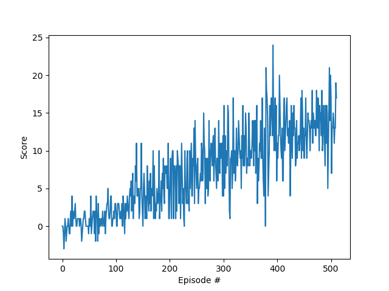

# Report

### Solution Method

For this problem we will use deep Q-Netowrk, which has proven to generalize to different environments in a satisfactory way [1].

Our neural network consists of only two hidden layers, both fully connected and with 32 neurons. We use ReLU as activation function, MSE as loss function, and Adam as optimizer.
The learning rate $\epsilon$ starts with a value of 1 and follows a decay schedule where, after each episode, decreases by 0.5%. The other hyperparameters are left with their default values.

### Results
This environment is considered solved after the agent is able to average a score of +13 over 100 episodes. 
With our implementation and hyperparameters choice, the agent achieves this in 411 episodes (with random seed=0). 
Here a plot of the score development through the episodes.

Please notice that without a fixed seed, results are stochastic and - based on the agent's decisions while navigating the environment - there will be a different number of attempts before reaching the desired target.

### Future work and possible improvements
Our goal of +13 score was met with a Vanilla DQN implementation. Over the past years, several improvements for this algorithm were developed and published.
In particular, we would like to test how _Double DQN_ [2] and _Rainbow_ [3] would perform compared to the simple DQN.

### Literature
[1] <a href="https://deepmind.com/research/dqn/" target="_blank">Human-level control through deep reinforcement learning</a>

[2] <a href="https://arxiv.org/abs/1509.06461" target="_blank">Deep Reinforcement Learning with Double Q-learning</a>

[3] <a href="https://arxiv.org/abs/1710.02298" target="_blank">Rainbow: Combining Improvements in Deep Reinforcement Learning</a>